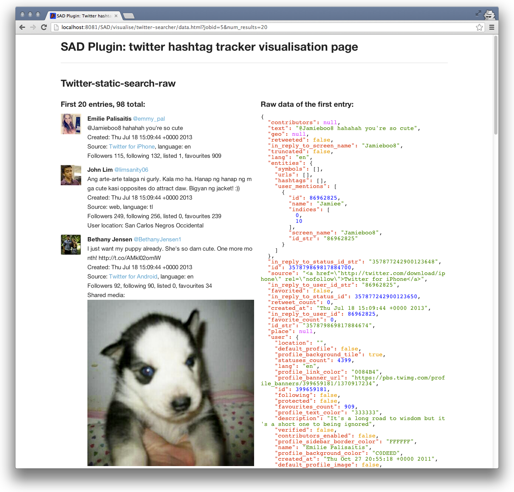

````````````````````````
Using sample SAD plugins
````````````````````````

This distribution comes with three sample plugins: Twitter searcher, Facebook collector and Basic SNS stats (located in **sad-plugins** folder). Each can be run either by :doc:`Using SAD Control panel <using_control_panel>` or with a :doc:`SAD Service API <service_api>`.

Twitter searcher (twitter-searcher)
===================================

This plugin retrieves up to 100 posts (argument: ``num_posts``) from Twitter using Social Integrator library. Supported search terms (argument: ``search_terms``) are:

 .. image:: _static/img/twitter_operators.png

It uses credentials located in **sad-plugins/twitter-searcher/src/main/resources/oauth-twitter.properties**.

For example, to search for "cute OR adorable" once using SAD Control panel, paste the following into Request template and click **Send request to run Plugin**:

 .. code-block:: javascript

  {
    "pluginName": "twitter-searcher",
    "arguments": [
      {
        "search_terms": "cute OR adorable"
      },
      {
        "num_posts": "99"
      }
    ],
    "inputs": [],
    "outputs": [
      {
        "type": "twitter-static-search-raw"
      }
    ],
    "schedule": {
      "times": 1,
      "withIntervalInMilliseconds": 20000
    }
  }

Use Job list at the bottom of the Control panel to monitor the progress of the plugin execution and once it's finished, use links under the plugin name to view:

**raw data** - collected tweets as JSON:

 .. code-block:: javascript

  {
    "response": {
    "series": {
    "0": {
    "jsonData": {
    "contributors": null,
    "text": "@Jamieboo8 hahahah you're so cute",
    ...
    },
    "num": 98,
    "jobstatus": "finished"
    }
  }

**visualised data** - HTML/CSS/JS rendering of raw data:



**job details** - JSON containing job's metadata:

 .. code-block:: javascript

  {
     "result":"ok",
     "response":{
        "job":{
           "ID":1,
           "PluginName":"twitter-searcher",
           "Name":"Job for plugin twitter-searcher",
           "Description":"Job created by Scheduling service",
           "Arguments":[
              {
                 "search_terms":"cute OR adorable"
              },
              {
                 "num_posts":"99"
              }
           ],
           "Inputs":[
           ],
           "Outputs":[
              {
                 "type":"twitter-static-search-raw"
              }
           ],
           "Schedule":{
              "times":1,
              "withIntervalInMilliseconds":20000
           },
           "Status":"finished",
           "WhenCreated_as_string":"2013-07-18 16:09:57",
           "WhenCreated_in_msec":1374160197491,
           "WhenLastrun_as_string":"2013-07-18 16:10:00",
           "WhenLastrun_in_msec":1374160200247,
           "Executions_num":1,
           "status_url":"http://localhost:8081/SAD/service/jobs/1",
           "data_url":"http://localhost:8081/SAD/service/jobs/1/data",
           "visualised_data_url":"http://localhost:8081/SAD/visualise/twitter-searcher/data.html?jobid=1&num_results=20"
        }
     }
  }

Facebook collector (facebook-collector)
=======================================

Uses Social Integrator library to collect ``max_posts`` recent posts from one or more Facebook pages (in case of multiple pages, ``max_posts`` recent posts from each page). Page names in ``page_name`` argument can be separated by commas or an individual ``page_name`` argument can be added for each Facebook page.

It uses credentials located in **sad-plugins/facebook-collector/src/main/resources/oauth-facebook.properties**.

For example, to collect recent 123 posts from each of "congressschladming", "cocacola", "Schladming2013" Facebook pages once using SAD Control panel, paste the following into Request template and click **Send request to run Plugin**:

 .. code-block:: javascript

  {
    "pluginName": "facebook-collector",
    "arguments": [
      {
        "page_name": "congressschladming, cocacola"
      },
      {
        "page_name": "Schladming2013"
      },
      {
        "max_posts": "123"
      }
    ],
    "inputs": [],
    "outputs": [
      {
        "type": "facebook-posts-raw"
      }
    ],
    "schedule": {
      "times": 1,
      "withIntervalInMilliseconds": 20000
    }
  }

Use Job list at the bottom of the Control panel to monitor the progress of the plugin execution and once it's finished, use links under the plugin name to view:

**visualised data** - HTML/CSS/JS rendering of raw Facebook data:

 .. image:: _static/img/facebook_collector_visualisation.png
  :width: 100 %


Hot tweets (hot-tweets) - only available in deployment release
==============================================================

Uses data collected by Twitter plugin to create a list of most influential tweets. It requires ``hours_back`` argument to know how far in the past to go back for input tweets and a location of data folder ``data_folder_path`` which is required by analysis algorythm:

 .. code-block:: javascript

  {
   "pluginName": "hot-tweets",
   "arguments": [
     {
       "hours_back": "1"
     },
     {
       "data_folder_path": "./data"
     }
   ],
   "inputs": [
     {
       "plugin_name": "twitter-searcher"
     }
   ],
   "outputs": [
     {
       "type": "twitter-hot-tweets"
     },
     {
       "type": "twitter-static-search-raw"
     }
   ],
   "schedule": {
     "times": 1,
     "withIntervalInMilliseconds": 20000
   }
  }

A feed of 5 latest hot tweets can be accessed at:

 .. code-block:: javascript

  <SAD basepath>/service/executions/hot-tweets/twitter-hot-tweets


Basic stats for Twitter/Facebook collected data (basic-sns-stats)
=================================================================

**Basic-sns-stats** plugin can fetch ``num_posts`` social network posts collected by Twitter and Facebook plugins (described above) and extract basic stats from that data. It also provides examples of direct database access including extraction of media links and descriptions.

For example, to analyse 54 posts from the output of each of two previous plugins once using SAD Control panel, paste the following into Request template and click **Send request to run Plugin**:

 .. code-block:: javascript

  {
    "pluginName": "basic-sns-stats",
    "arguments": [
      {
        "num_posts": "54"
      }
    ],
    "inputs": [
      {
        "plugin_name": "twitter-searcher"
      },
      {
        "plugin_name": "facebook-collector"
      }
    ],
    "outputs": [
      {
        "type": "twitter-basic-stats"
      },
      {
        "type": "facebook-basic-stats"
      }
    ],
    "schedule": {
      "times": 1,
      "withIntervalInMilliseconds": 20000
    }
  }

Use Job list at the bottom of the Control panel to monitor the progress of the plugin execution and once it's finished, use links under the plugin name to view:

**visualised data** - HTML/CSS/JS rendering of raw basic stats data:

  .. image:: _static/img/basic_stats_visualisation.png
   :width: 100 %

Extracted media links with descriptions can be requested with the following output type:

 .. code-block:: javascript

    "outputs": [
      {
        "type": "media-links-with-descriptions"
      },

and visualised alongside other output types:

 .. image:: _static/img/media_links_visualised.png
  :width: 100 %


Next steps
==========

:doc:`SAD Service API <service_api>`

:doc:`ECC integration <eccintegration>`

:doc:`Plugin development <plugin_dev>`