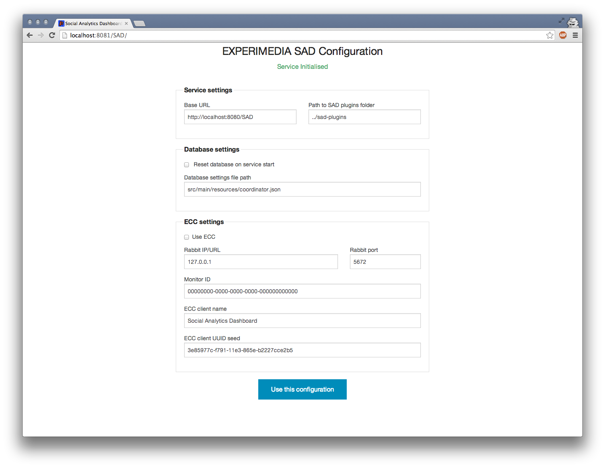

`````````````````````````````````
Running & Configuring SAD Service
`````````````````````````````````

Before following instructions on this page, make sure you followed the previous section of this documentation regarding SAD service and plugins installation and the following files and folders exist:

 .. code-block:: sh

  sad-service/target/sad-service-2.6.war
  sad-service/src/main/webapp/visualise/basic-sns-stats
  sad-service/src/main/webapp/visualise/facebook-collector
  sad-service/src/main/webapp/visualise/twitter-searcher

  sad-plugins/basic-sns-stats/configuration.json
  sad-plugins/basic-sns-stats/target/basic-sns-stats-2.6.jar
  sad-plugins/basic-sns-stats/target/lib

  sad-plugins/facebook-collector/configuration.json
  sad-plugins/facebook-collector/target/facebook-collector-2.6.jar
  sad-plugins/facebook-collector/target/lib

  sad-plugins/hot-tweets/configuration.json
  sad-plugins/hot-tweets/target/hot-tweets-2.6.jar
  sad-plugins/hot-tweets/target/lib

  sad-plugins/twitter-searcher/configuration.json
  sad-plugins/twitter-searcher/target/twitter-searcher-2.6.jar
  sad-plugins/twitter-searcher/target/lib

Two ways to run SAD service are detailed below.

Running with Spring Boot
========================

This way to run SAD is better suited for development due to ease of redeployment process and access to service logging.

Change into **sad-service** folder and use maven to run jetty:

 .. code-block:: javascript

  cd sad-service
  mvn spring-boot:run

The dashboard should be running on port 8081 (controlled by **server.port** setting). SAD configuration page should be accessible (after successful authentication) at:

 .. code-block:: html

  http://localhost:8081/SAD


Running with Apache Tomcat
==========================

1. If you selected to enable ECC integration, make sure that both RabbitMQ server and ECC Dashboard are running.

2. Deploy **sad-service/target/sad-service-2.6.war** in Tomcat.

3. Stop Tomcat, rename **webapps/sad-service-2.6** into **webapps/SAD** (alternatively, set **server.context-path=/sad-service-2.6** in SAD service settings in **webapps/sad-service-2.6/WEB-INF/classes/application.properties**).

4. Make sure that **server.port** in SAD service settings matches your Tomcat port.

SAD configuration page should be accessible (after successful authentication) at:

 .. code-block:: html

  http://localhost:8081/SAD


Running with Vagrant
====================

1. Requires Vagrant software to be installed: http://www.vagrantup.com along with something like Virtualbox (https://www.virtualbox.org)

3. Make sure nothing is using port 8081

2. Make sure you are in the root folder of this distribution, then in console type:

 .. code-block:: javascript

  vagrant up

3. Wait for script to finish and SAD configuration page should be accessible (after successful authentication) at:

 .. code-block:: html

  http://localhost:8081/SAD


Configuring SAD service
=======================

SAD configuration page offers service, database and ECC settings:



**Service settings**

* **Base URL**: full URL that is used by SAD to generate links to produced results.
* **Path to SAD plugins folder**: path to a folder on the hard drive that contains SAD plugin folders.


**Database settings**

* **Reset database on service start**: if checked, will result in database with **database.name** in **Database settings file path** file to be wiped when 'Use this configuration' button is clicked.
* **Database settings file path**: path to the file with database configuration.


**ECC settings**

* **Use ECC**: if checked, ECC clients for all plugins and the service will be created using ECC settings below.
* **Rabbit IP/URL**, **Rabbit port**, **Monitor ID**: standard ECC client settings.
* **ECC client name**: name for SAD service client to be used.
* **ECC client UUID seed**: incomplete UUID that is used to create unique ECC client identifiers for the SAD service and plugins. For example, if the seed is '3e85977c-f791-11e3-865e-b2227cce2b5', then the following UUIDs will be used:

 * 3e85977c-f791-11e3-865e-b2227cce2b50 by the SAD service's ECC client.
 * 3e85977c-f791-11e3-865e-b2227cce2b51 by the ECC client of the first SAD plugin in SAD plugins folder.
 * 3e85977c-f791-11e3-865e-b2227cce2b52 by the ECC client of the second SAD plugin in SAD plugins folder.
 * ...

 This is done to ensure that:

  1. SAD can reconnect to ECC and not appear as a set of completely new ECC clients.
  2. In case of several SAD deployments using the same ECC to report data, they will appear as different clients.


Once configured, click on 'Use this configuration' button to continue to SAD Control panel.

Next steps
==========

:doc:`Using SAD Control panel <using_control_panel>`

:doc:`Plugin development <plugin_dev>`

:doc:`SAD Service API <service_api>`