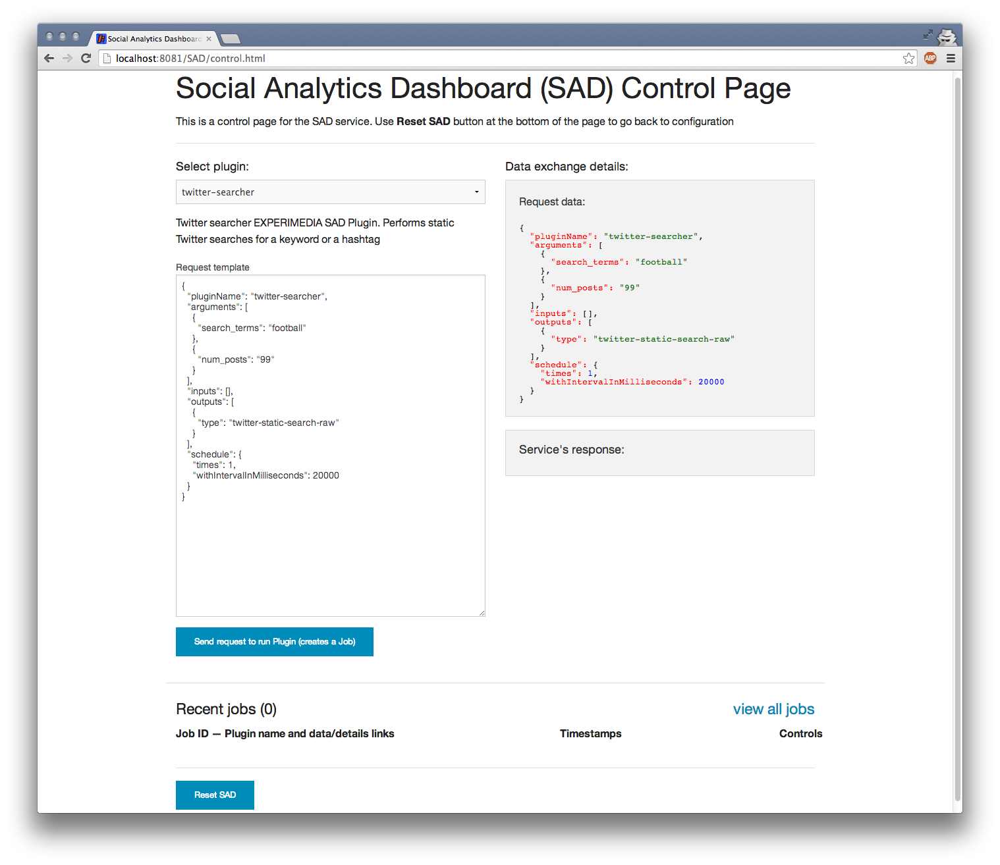

```````````````````````
Using SAD Control panel
```````````````````````

SAD Control panel page is only available when the service is fully configured. It helps launch SAD plugins, view existing jobs and access job details and visualisations of output data by combining a few calls to :doc:`SAD Service API <service_api>`:



Installed SAD plugins can be found under the dropdown box in top right corner. Selecting a plugin will create a Request template (based on the plugin's configuration) in the text field below that can be used to manually adjust any parameters.

Area to the right is reserved for display of the data sent to the SAD service to run a plugin and also the service's response (once the plugin has been submitted).

The list of created jobs with links to raw data, visualisations, details and execution controls is at the bottom of the page:

 .. image:: _static/img/sad_control_list_of_jobs.png
  :width: 100 %


Arguments, inputs, outputs
==========================

Arguments should contain key-value pairs as define in the plugin's configuration file **configuration.json**. Multiple instances of keys are allowed:

 .. code-block:: javascript

  "arguments": [
    {
      "search_terms": "football"
    },
    {
      "search_terms": "soccer OR championship"
    },
    {
      "num_posts": "99"
    }
   ]


Inputs can contain one or more entries specifying SAD Job ID or another plugin's name:

 .. code-block:: javascript

  "inputs": [
    {
      "job_id": "521dd8a76532b2410b54dcc1"
    },
    {
      "plugin_name": "twitter-searcher"
    }
  ]

For example, to make **basic-sns-stats** plugin use outputs of both **twitter-searcher** and **facebook-collector** plugins, set inputs to the following:

 .. code-block:: javascript

  "inputs": [
    {
      "plugin_name": "twitter-searcher"
    },
    {
      "plugin_name": "facebook-collector"
    }
  ]

Outputs tell the plugin what type of data (see :doc:`Data types <data_types>`) to save to the database as output. For example, **basic-sns-stats** can output for types of data as defined in its configuration:

 .. code-block:: javascript

  "outputs": {
     "data": [
     {
         "type": "twitter-basic-stats",
         "description": "JSON containing basic stats extracted from processed tweets"
     },
     {
         "type": "twitter-static-search-raw",
         "description": "JSON containing tweets used in the analysis"
     },
     {
         "type": "facebook-basic-stats",
         "description": "JSON containing basic stats extracted from processed Facebook posts"
     },
     {
         "type": "facebook-posts-raw",
         "description": "JSON containing Facebook posts used in the analysis"
     }
     ]
  }

If processed tweets and posts are not required as its output, only stats can be requested:

 .. code-block:: javascript

  "outputs": [
    {
      "type": "twitter-basic-stats"
    },
    {
      "type": "facebook-basic-stats"
    }
  ]


Scheduling
==========

Scheduling of the plugin execution has the following parameters:

 .. code-block:: javascript

  "schedule": {
    "startAt": 1405759070000,
    "times": 1,
    "withIntervalInMilliseconds": 20000,
    "endAt": 1405762670000
  }

``startAt``: time in msec on when to start running the plugin.

``times``: number of times the plugin will be executed.

``withIntervalInMilliseconds``: interval between executions.

``endAt``: when to stop creating new executions.

Common combinations of those parameters are:

* start now, run ten times with twenty seconds interval

 .. code-block:: javascript

  "schedule": {
    "times": 10,
    "withIntervalInMilliseconds": 20000
  }

* start on Fri Jul 19 2014 09:37:50 GMT+0100 (BST), run ten times with twenty seconds interval

 .. code-block:: javascript

  "schedule": {
    "startAt": 1405759070000,
    "times": 10,
    "withIntervalInMilliseconds": 20000
  }

* start on Fri Jul 19 2014 09:37:50 GMT+0100 (BST), finish in one hour with twenty seconds interval

 .. code-block:: javascript

  "schedule": {
    "startAt": 1405759070000,
    "withIntervalInMilliseconds": 20000,
    "endAt": 1405762670000
  }

Jobs and Executions
===================

To run a plugin means to send a data request to the service containing plugin name, arguments, inputs, outputs and a schedule. **Running plugins** creates **Jobs**. Depending on a ``schedule``, a Job can have one or more **Executions**.

For example, submittion of:

 .. code-block:: javascript

  {
    "pluginName": "twitter-searcher",
    "arguments": [
    ...
    "schedule": {
      "times": 1,
      "withIntervalInMilliseconds": 20000
    }
  }

creates a twitter-searcher Job with one Execution.

 .. code-block:: javascript

  {
    "pluginName": "facebook-collector",
    "arguments": [
    ...
    "schedule": {
      "times": 5,
      "withIntervalInMilliseconds": 10000
    }
  }

will create another Job with five Executions.

Logging
=======

Both stdout and stderr from plugin executions appear in the service logs and individually in temporary .txt files:

 .. image:: _static/img/plugin_logs.png

The location of the temporary folder depends on the operating system and the way you chose to deploy SAD (Jetty, Tomcat etc.). Location of each temporary file is printed in the service log before and after each plugin execution:

 .. code-block:: javascript

  2014-03-12 10:45:40,561 DEBUG   [SadScheduler_Worker-4 | PluginRunner:157] Executing plugin 'hot-tweets' as job [53203ad43004ee8c434c681c] with command (as an array, not plain string): java -cp /Users/max/Documents/Work/experimedia/SAD/experimedia-sad/sad-plugins/hot-tweets/target/lib/* -jar /Users/max/Documents/Work/experimedia/SAD/experimedia-sad/sad-plugins/hot-tweets/target/hot-tweets-2.6.jar execute /Users/max/Documents/Work/experimedia/SAD/experimedia-sad/sad-service/src/main/resources/coordinator.json 53203ad43004ee8c434c681c 61102
  2014-03-12 10:45:40,561 DEBUG   [SadScheduler_Worker-4 | PluginRunner:163] STD OUT path: /var/folders/xf/3bb43x651yz50_8sfhc0b_2r0000gn/T/log-hot-tweets-13946211405612987986579489586052.txt
  2014-03-12 10:45:40,562 DEBUG   [SadScheduler_Worker-4 | PluginRunner:172] STD ERR path: /var/folders/xf/3bb43x651yz50_8sfhc0b_2r0000gn/T/error-hot-tweets-13946211405614578272892819600364.txt

  ...

  2014-03-12 10:45:48,083 DEBUG   [SadScheduler_Worker-4 | PluginRunner:295] JOB EXECUTION FINISHED
  2014-03-12 10:45:48,083 DEBUG   [SadScheduler_Worker-4 | PluginRunner:301] STD OUT path again: /var/folders/xf/3bb43x651yz50_8sfhc0b_2r0000gn/T/log-hot-tweets-13946211405612987986579489586052.txt
  2014-03-12 10:45:48,083 DEBUG   [SadScheduler_Worker-4 | PluginRunner:304] STD ERR path again: /var/folders/xf/3bb43x651yz50_8sfhc0b_2r0000gn/T/error-hot-tweets-13946211405614578272892819600364.txt

Next steps
==========

:doc:`Using sample SAD plugins <sample_plugins>`

:doc:`Plugin development <plugin_dev>`

:doc:`SAD Service API <service_api>`

:doc:`SAD configuration files explained <config_files>`